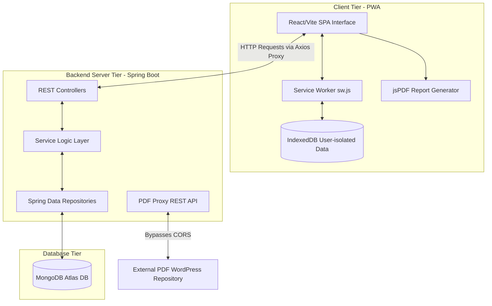
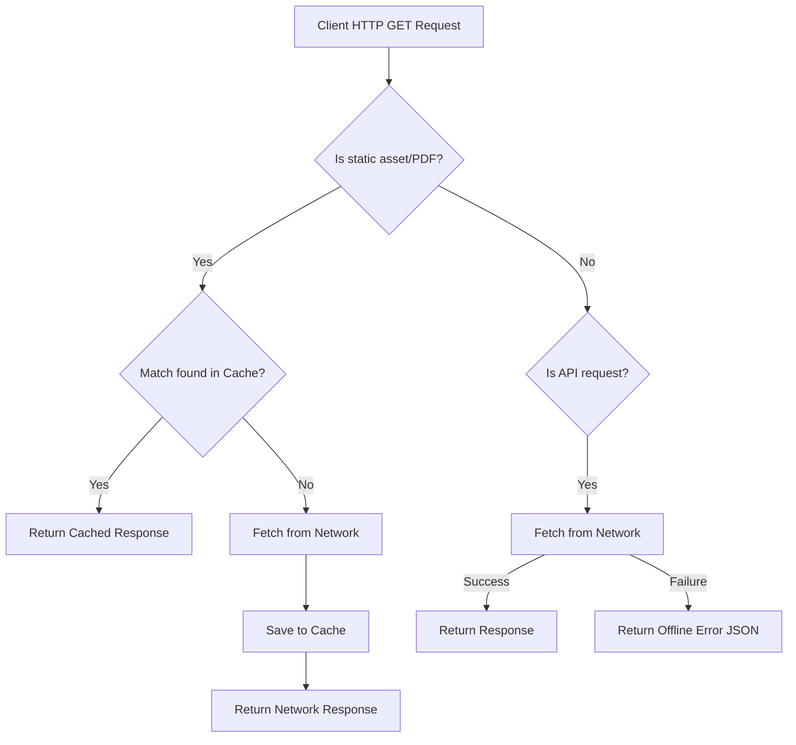

# 📘 PROJECT DOCUMENTATION: TNPSC HUB

## 1. Project Introduction
Preparing for the Tamil Nadu Public Service Commission (TNPSC) examinations is a highly competitive process, requiring aspirants to study extensive subject matter from Samacheer Kalvi textbooks and take multiple practice exams.

**TNPSC HUB** is a Progressive Web Application (PWA) designed to aid candidates preparing for TNPSC Group 1, 2, 2A, 4, and VAO exams. It provides offline-first study materials, customizable practice tests, daily/weekly contests with leaderboards, and personalized progress tracking.

---

## 2. Problem Statement & Objectives

### Problem Statement
Aspirants preparing for competitive government examinations face several challenges:
1.  **Scattered Study Resources:** Textbooks, answer keys, and previous papers are scattered across unorganized blogs and websites.
2.  **CORS Restrictions:** Web applications attempting to display external educational materials directly frequently fail due to Cross-Origin Resource Sharing (CORS) blocks.
3.  **Unstable Internet Connectivity:** Aspirants in rural or remote areas have inconsistent internet connections, preventing them from accessing online files.
4.  **Lack of Self-Assessment Tools:** Many free platforms only offer static reading lists without timed practice engines or analytics.

### Objectives
*   **Centralize Preparation Materials:** Unify Samacheer Kalvi books, study notes, and previous year question papers in one interface.
*   **Ensure Offline Continuity:** Utilize service workers and IndexedDB storage to allow candidates to download and read books offline inside the app.
*   **Bypass CORS Limitations:** Build a backend proxy to stream external files securely, enabling inline rendering.
*   **Offer Dynamic Mock Exams:** Implement a client-side test engine that compiles questions across different difficulties (Easy, Medium, Hard) into timed mock exams.
*   **Implement Analytics:** Help users track their learning history via progress line charts and downloadable PDF report cards.

---

## 3. System Architecture

The platform uses a three-tier architecture that supports local offline execution:



*   **PWA Client:** React Single Page Application (SPA) utilizing Service Workers for request interception and IndexedDB for local data persistence.
*   **API Service Gateway:** Spring Boot MVC application mapping endpoint controls, security permissions, and file proxy handlers.
*   **Database Tier:** MongoDB instance storing document collections for users, quizzes, results, contests, and achievements.

---

## 4. Frontend Architecture

### Technology Stack
*   **Core:** React v18.2.0, Vite v5.0.8, TailwindCSS v3.3.0
*   **Routing:** React Router DOM v6.20.0
*   **HTTP Client:** Axios v1.6.0 with custom interceptors
*   **Document Generation:** jsPDF v3.0.4

### Component & Page Architecture
*   **Auth Guards (`ProtectedRoute.jsx`):** Secures study and testing views. Redirects unauthenticated traffic to `/login` while maintaining navigation history.
*   **Context States:**
    *   `AuthContext.jsx`: Restores user state from backend database queries on mount, and handles login/logout tasks.
    *   `ThemeContext.jsx`: Manages dark/light mode states, applying the `.dark` class to `document.documentElement` to trigger TailwindCSS dark mode styling.
*   **IndexedDB Caching (`offlineStorage.js`):** Integrates IndexedDB with distinct stores:
    *   `books`: Caches book metadata (download timestamps, size, subject classification).
    *   `pdfs`: Caches the raw PDF document binary as a `Blob`.
    *   *User Isolation:* Caching keys are prefixed with `${userId}_` to keep each student's download list isolated on shared devices.

---

## 5. Backend Architecture

### Technology Stack
*   **Core Framework:** Spring Boot v3.2.0, Java 17
*   **Security:** Spring Security v3.2.0 configuration
*   **Database Connector:** Spring Data MongoDB
*   **Utilities:** Lombok, DevTools

### Layers & Architecture Patterns
*   **Controller Layer:** REST API Controllers mapping HTTP request parameters, CORS rules, and payloads.
*   **Service Layer:** Implements core business logic, including:
    *   `AuthService`: Manages registration normalization and credentials check.
    *   `ProgressService`: Aggregates user progress metrics from `results` and `resource_activities`.
    *   `ContestService`: Manages dynamic contests, streaks, and leaderboards.
*   **Repository Layer:** Declarative interfaces extending `MongoRepository` to automate query operations.
*   **CORS and PDF Proxy:**
    *   `SecurityConfig.java` allows local network IP patterns (`192.168.*`) to enable local multi-device testing.
    *   `PdfProxyController.java` fetches external files via `RestTemplate`, streaming bytes back with PDF headers inline to bypass browser CORS blocks.

---

## 6. MongoDB Database Design

The database stores 12 collections:

```text
    ┌──────────────┐
    │     User     │
    └──────┬───────┘
           │ (1)
           ├───────────────────────────────┐
           │ (Many)                        │ (Many)
    ┌──────▼───────┐                ┌──────▼─────────────┐
    │    Result    │                │  ResourceActivity  │
    └──────┬───────┘                └──────┬─────────────┘
           │ (Many)                        │ (Many)
    ┌──────▼───────┐                ┌──────▼─────────────┐
    │     Quiz     │                │   Book / PdfBook   │
    └──────┬───────┘                └────────────────────┘
           │ (Embedded List)
    ┌──────▼─────────────┐
    │  QuestionEmbedded  │
    └────────────────────┘
```

### Collection Schemas & Fields

#### Users Collection (`users`)
*   `id`: String (Primary Key)
*   `firstName`: String, `lastName`: String
*   `email`: String (Normalized lowercase, unique index)
*   `password`: String (Stored as plain-text in dev DB)
*   `phone`: String, `dateOfBirth`: String, `gender`: String
*   `targetExam`: String (e.g. `Group 2`, `Group 4`)
*   `studyHoursPerDay`: Integer
*   `emailNotifications`: Boolean, `pushNotifications`: Boolean
*   `createdAt`: LocalDateTime, `updatedAt`: LocalDateTime

#### Quizzes Collection (`quizzes`)
*   `id`: String (Primary Key)
*   `title`: String, `description`: String
*   `subject`: String, `difficulty`: String, `level`: String
*   `totalQuestions`: Integer, `passingScore`: Integer, `timeLimit`: Integer
*   `questionIds`: List\<String\> (References to separate `questions` collection)
*   `questions`: List\<QuestionEmbedded\> (Embedded full question documents)

#### Questions Collection (`questions`)
*   `id`: String (Primary Key)
*   `quizId`: String (References parent quiz)
*   `questionText`: String
*   `options`: List\<String\>
*   `correctAnswerIndex`: Integer
*   `explanation`: String, `difficulty`: String, `subject`: String

#### Contest Results Collection (`contest_results`)
*   `id`: String (Primary Key)
*   `contestId`: String, `contestType`: String (`DAILY` or `WEEKLY`)
*   `userId`: String, `userName`: String, `userEmail`: String
*   `score`: Integer, `totalMarks`: Integer, `correctAnswers`: Integer, `wrongAnswers`: Integer, `totalQuestions`: Integer
*   `timeTakenSeconds`: Long, `accuracy`: Double, `averageTimePerQuestion`: Double, `rank`: Integer
*   `answersMap`: Map\<String, Integer\> (Map of questionId to selected option index)
*   **Indexes:**
    *   Compound unique index named `user_contest_idx` on fields `{ userId: 1, contestId: 1 }` prevents duplicate user submissions for the same contest.

---

## 7. Authentication Flow

```mermaid
sequenceDiagram
    autonumber
    actor Student
    participant UI as React UI (Login.jsx)
    participant AuthContext as AuthContext.jsx
    participant API as api.js (Axios)
    participant Backend as Spring Boot (AuthController)
    database DB as MongoDB Atlas (users)

    Student->>UI: Input credentials
    UI->>API: POST /auth/login
    API->>Backend: Forward login request
    Backend->>DB: Query user by email
    DB-->>Backend: Return user credentials
    Backend->>Backend: Verify password equality
    Backend->>Backend: Generate token_ + userId + timestamp
    Backend-->>API: Return 200 OK + User Object + Token
    API-->>UI: Return response data
    UI->>AuthContext: Trigger login(user, token)
    AuthContext->>AuthContext: Save user & token to sessionStorage
    AuthContext->>UI: Redirect to /dashboard
```

---

## 8. API Details

All requests are prefixed with `/api`.

### 8.1 Authentication Endpoints (`/auth`)
*   `POST /auth/register`: Registers a new user. Returns user details and session token.
*   `POST /auth/login`: Authenticates user credentials. Returns user details and token.
*   `POST /auth/validate-token`: Accepts `{"token": "..."}` and returns `{"valid": true/false}`.
*   `GET /auth/health`: Health status endpoint.

### 8.2 User Profile Endpoints (`/users`)
*   `GET /users/{id}`: Returns user profile details.
*   `PUT /users/{id}`: Updates user details.
*   `GET /users/stats/{userId}`: Returns statistics (tests completed, average score, streaks).
*   `GET /users/achievements/{userId}`: Returns unlocked user badges.

### 8.3 Quiz Endpoints (`/quizzes`)
*   `GET /quizzes`: Lists all quizzes.
*   `GET /quizzes/{id}`: Returns a quiz by ID.
*   `GET /quizzes/{id}/questions`: Lists questions for a quiz.
*   `POST /quizzes/{quizId}/submit`: Saves quiz completion metrics in the `results` collection.

### 8.4 Book Endpoints (`/books`, `/pdf-books`, `/pdf-proxy`)
*   `GET /books`: Lists uploaded books.
*   `POST /books/upload`: Accepts multipart files (PDFs) and saves binary payloads in MongoDB.
*   `GET /books/download/{id}`: Downloads binary files or returns URL locations.
*   `GET /pdf-proxy`: Bypasses CORS by proxying external PDF URLs.

---

## 9. Security Features

*   **Custom Token Verification:** Employs a custom prefix token pattern (`token_`) verified on the frontend by Axios interceptors and validated on the backend.
*   **Session Isolation:** Stores the active session token in `sessionStorage`, automatically destroying the session when the user closes their browser tab.
*   **Subnet Debugging Rules:** CORS policies allow local subnet access, enabling developers to test mobile PWA installs using a local development server.
*   **Secure Secrets:** Externalizes server credentials, MongoDB URLs, and API keys to environment configuration files.

---

## 10. PWA Implementation

The application uses native service worker mechanisms for offline support:



*   **Caching Strategy:**
    *   **PDF Caching:** Service worker intercepts `/api/pdf-proxy` and saves PDF documents in a dedicated `PDF_CACHE` ('tngov-pdf-cache-v1') with cache-first behavior for offline availability.
    *   **Static Assets:** Uses a cache-first network-fallback strategy for compiled scripts, CSS styling, and media resources.
    *   **API Interception:** Uses network-first caching for API calls to prevent stale dashboard statistics.
*   **SPA Navigation Fallback:** Serves `index.html` on failed navigations when offline to keep client-side routing working.
*   **Install Promotion:** Implements browser install hooks, with distinct onboarding flows for Android/Desktop (W3C native install prompts) and iOS Safari ("Add to Home Screen").

---

## 11. Folder Structure Explanation

*   `backend/`:
    *   `config/`: Spring Security and CORS filter classes.
    *   `controller/`: REST controller mapping handlers.
    *   `entity/`: MongoDB database schema declaration models.
    *   `repository/`: Standard MongoRepository interfaces.
    *   `service/`: Services for business logic, analytics, and messaging.
*   `frontend/`:
    *   `public/`: PWAs manifest configuration, icons, and service worker codes.
    *   `src/components/`: Modular widgets and authentication route guards.
    *   `src/context/`: Core contexts for auth and theme states.
    *   `src/pages/`: Top-level page views (Dashboard, PDFViewer, Quiz, PracticeTest).
    *   `src/services/`: API connection hooks and IndexedDB local caching libraries.

---

## 12. Environment Variables

### Backend (`backend/.env`)
*   `MONGODB_URI`: Connection string to MongoDB database instance.
*   `PORT`: Port the Spring Boot application runs on (default: `8080`).
*   `JWT_SECRET`: Secret key string used for token validation.
*   `MAIL_USERNAME` / `MAIL_PASSWORD`: Optional SMTP server access credentials.
*   `GEMINI_API_KEY` / `OPENAI_API_KEY`: API keys for model integrations.

### Frontend (`frontend/.env`)
*   `VITE_API_BASE_URL`: Relative endpoint context path (set to `/api` to align with the Vite proxy).
*   `VITE_API_TIMEOUT`: HTTP client request timeout threshold (default: `10000` ms).

---

## 13. Deployment Guide

### Backend Package Generation
Compile and package dependencies into a runnable JAR file:
```bash
cd backend
mvn clean package -DskipTests
# Run JAR
java -jar target/tnexam-backend-1.0.0.jar
```

### Frontend Static Build
Compile and optimize frontend assets for deployment:
```bash
cd frontend
npm run build
# Built files reside in frontend/dist/ directory
```

---

## 14. Challenges Faced & Solutions Implemented

### Challenge 1: Browser CORS Restrictions on PDFs
*   *Detail:* Accessing PDFs directly from external CDNs (like WordPress hosts) in an iframe or viewer triggers CORS blocks on the client.
*   *Solution:* Implemented `PdfProxyController.java` on the backend, which downloads files as byte arrays via `RestTemplate` and streams them back to the client with `Content-Type: application/pdf` and `Content-Disposition: inline`.

### Challenge 2: Mobile PWA Subnet Testing
*   *Detail:* Testing PWA installations on mobile devices during local development requires connecting to the development server over the local network, which is often blocked by CORS policies.
*   *Solution:* Configured `SecurityConfig.java` to dynamically allow local subnet origin patterns (`192.168.*.*`) for local development.

### Challenge 3: Isolated Offline Storage
*   *Detail:* Multiple users sharing the same device could access each other's downloaded offline files in IndexedDB.
*   *Solution:* Prepend `userId_` to all IndexedDB caching keys, keeping downloaded study lists isolated per user.

---

## 15. Future Scope & Conclusion

### Future Scope
*   **BCrypt Hashing:** Encrypt user passwords before saving them to MongoDB.
*   **Standard JWT Filter:** Transition the custom prefix token model to signed JWT validation filters.
*   **Discussion Forums:** Implement comment threads under books and quizzes for group study.

### Conclusion
TNPSC HUB is a complete, offline-first preparation platform. By combining a Spring Boot API backend, MongoDB Atlas storage, a React Vite client, and a Service Worker caching engine, the platform provides robust accessibility and a unified preparation experience for competitive exam candidates.
