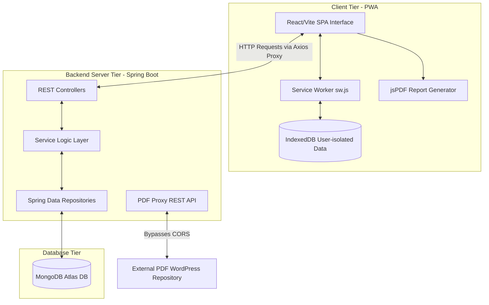

# 🎯 TNPSC HUB — Tamil Nadu Government Exam Preparation Platform

[](https://github.com/hp5cd/TNPSC-Preparation-Platform-main)
[](https://github.com/hp5cd/TNPSC-Preparation-Platform-main)
[](https://github.com/hp5cd/TNPSC-Preparation-Platform-main)
[](https://opensource.org/licenses/MIT)

TNPSC HUB is a premium, full-stack, Progressive Web Application (PWA) designed to aid candidates preparing for Tamil Nadu Government Exams (TNPSC Groups 1, 2, 2A, 4, and VAO). Utilizing an offline-first study architecture, dynamic practice testing suites, live contests with analytics-driven leaderboards, and personalized progress tracking, this platform is an all-in-one preparation engine.

---

## 📸 Visual Overview & Mockups

### Project Banner
*Placeholder: [TNPSC Hub Banner](https://placehold.co/1200x400/4f46e5/ffffff?text=TNPSC+HUB+Preparation+Platform)*

### Screen Mockups
| Mobile Dashboard & Streaks | Mobile PDF Reader & Offline Tool |
| :---: | :---: |
| *Placeholder: [Dashboard Mobile UI](https://placehold.co/300x600/0f172a/ffffff?text=Dashboard+Mobile)* | *Placeholder: [PDF Viewer Offline](https://placehold.co/300x600/0f172a/ffffff?text=PDF+Reader+Mobile)* |

*Placeholder: [Demo Walkthrough GIF](https://placehold.co/800x450/e2e8f0/0f172a?text=App+Walkthrough+Demo)*

*Live Demo: [View Platform Deployment](http://localhost:3000)*

---

## 🏗️ Architecture Overview

The system follows a three-tier architecture with support for offline execution, data proxy caching, and client-side PDF compilation:



*   **PWA Client:** React Single Page Application (SPA) utilizing Service Workers for request interception and IndexedDB for local data persistence.
*   **API Service Gateway:** Spring Boot MVC application mapping endpoint controls, security permissions, and file proxy handlers.
*   **Database Tier:** MongoDB instance storing document collections for users, quizzes, results, contests, and achievements.

---

## 🌟 Key Features

*   **🔐 Secure Authentication:** JWT-inspired token model stored in `sessionStorage` (automatically cleared on browser exit) with protected routes.
*   **📖 Study Library:** Instant access to Samacheer Kalvi school notes (standards 6th to 12th) and exam answer keys.
*   **📥 User-Isolated Offline Mode:** Download specific study books as binary blobs into the browser's IndexedDB. Download lists are isolated per user profile.
*   **🔄 PDF Proxy:** Spring Boot REST proxy endpoint fetches external PDF files, bypassing CORS restrictions on mobile/desktop browsers.
*   **📝 Timed Practice Test:** compiles a mock exam of 50 questions (15 easy, 20 medium, 15 hard) with a 60-minute countdown.
*   **🏆 Daily & Weekly Contests:** Compete in timed contests with leaderboard listings sorting candidates by score and speed.
*   **📈 Progress Reporting:** Tracks performance histories and generates formatted, printable PDF progress reports using `jsPDF`.
*   **📱 Native App Installation:** Custom installation prompt widget catering to Android/Chrome and iOS Safari environments.

---

## 💻 Technology Stack

*   **Frontend Core:** React v18.2.0, Vite v5.0.8, TailwindCSS v3.3.0
*   **Frontend Routing:** React Router DOM v6.20.0
*   **API client:** Axios v1.6.0
*   **Offline Cache:** W3C Service Worker API, IndexedDB, Web App Manifest
*   **Backend Core:** Java 17, Spring Boot v3.2.0 (Spring Web, Spring Security)
*   **Database:** MongoDB Atlas (via Spring Data MongoDB Starter)
*   **Build Systems:** Maven (Java), npm (Vite)
*   **PDF Generation:** jsPDF v3.0.4

---

## 📂 Folder Structure Summary

```text
TNPSC-Preparation-Platform/
├── backend/                  # Spring Boot Service Root
│   ├── src/main/java/com/tnexam/
│   │   ├── config/           # Spring Security and CORS Setup
│   │   ├── controller/       # REST API Endpoints
│   │   ├── entity/           # MongoDB Collection Data Models
│   │   ├── repository/       # Database Query Repositories
│   │   └── service/          # Business Logic & Streaks Analytics
│   └── pom.xml               # Maven configuration
└── frontend/                 # React UI Client Root
    ├── public/               # Service Worker, Manifest, PWA Icons
    ├── src/
    │   ├── components/       # Reusable layout UI components & guards
    │   ├── config/           # Routes constants & styling themes
    │   ├── context/          # Auth & Theme state engine contexts
    │   ├── hooks/            # Axios API wrappers
    │   ├── pages/            # View Pages (Dashboard, PDFViewer, Quiz...)
    │   ├── services/         # Storage and IndexedDB offline services
    │   └── utils/            # Input validations & helpers
    └── package.json          # npm dependecy list & scripts
```

---

## ⚙️ Installation & Setup

### Prerequisites
*   Java Development Kit (JDK) 17 or higher
*   Apache Maven 3.8+
*   Node.js 18+ & npm 9+
*   MongoDB Instance (Local running daemon or Atlas cloud URI)

### 1. Database Setup
Verify that your local MongoDB server is active on `mongodb://localhost:27017` or prepare your MongoDB Atlas connection string.

### 2. Run Backend Service
```bash
cd backend
cp .env.example .env
# Adjust MONGODB_URI and PORT in the backend .env
mvn clean install
mvn spring-boot:run
```

### 3. Run Frontend Client
```bash
cd frontend
cp .env.example .env
# Verify VITE_API_BASE_URL is set to /api in the frontend .env
npm install
npm run dev
```
Open `http://localhost:3000` to interact with the platform.

---

## 🌍 Environment Variables (Summary)

### Backend Configuration (`backend/.env`)
*   `MONGODB_URI`: Connection string to MongoDB database instance.
*   `PORT`: Port the Spring Boot application runs on (default: `8080`).
*   `JWT_SECRET`: Secret key string used for token definitions.

### Frontend Configuration (`frontend/.env`)
*   `VITE_API_BASE_URL`: Relative endpoint context path (set to `/api` to align with the Vite proxy).
*   `VITE_API_TIMEOUT`: HTTP client request timeout threshold (default: `10000` ms).

---

## 📱 PWA Features
*   **Pre-caching Assets:** Pre-caches layout shells, SVG icons, and main scripts upon installation.
*   **Static Caching:** Utilizes a cache-first network-fallback strategy for styling, script bundles, and local images.
*   **Offline Viewer:** Intercepts `/api/pdf-proxy` and saves downloaded PDFs in a dedicated service worker cache.
*   **Add to Home Screen:** Installs natively on mobile devices and desktops with offline startup, standalone display mode, and target VAO shortcuts.

---

## 🚀 Deployment (Summary)

### Backend Packaging
```bash
cd backend
mvn clean package -DskipTests
# Run JAR
java -jar target/tnexam-backend-1.0.0.jar
```

### Frontend Compilation
```bash
cd frontend
npm run build
# Built files reside in frontend/dist/ directory
```

---

## 📡 API Overview (Summary)

| Method | Endpoint | Description | Auth Required |
| :--- | :--- | :--- | :---: |
| `POST` | `/api/auth/register` | Register new student profile | No |
| `POST` | `/api/auth/login` | Login and obtain session token | No |
| `GET` | `/api/quizzes` | List all available quizzes | Yes |
| `POST` | `/api/results` | Submit user quiz/test results | Yes |
| `GET` | `/api/results/user/{userId}` | Fetch result history of a student | Yes |
| `GET` | `/api/contests/daily` | Obtain active daily contest | Yes |
| `GET` | `/api/pdf-proxy` | Streams external PDF files inline | Yes |

---

## 🔄 Project Workflow
```text
[Register/Login] ──► [Dashboard] ───┬──► [Practice Test (Dynamic balanced 50 questions)]
                                    ├──► [Subjects & Quizzes (Topic assessments)]
                                    ├──► [Study Library] ──► [Read online/Save offline to IDB]
                                    └──► [Daily/Weekly Contests] ──► [Compete & Rank]
```

---

## 🔮 Future Enhancements
*   **JWT Implementation:** Integrate spring-security filter chains with cryptographic JWT verification.
*   **Password Encryption:** Integrate BCrypt password encoding on user registration.
*   **Discussion Forums:** Add subject threads to connect candidates.
*   **Push Notifications:** Hook in Firebase Cloud Messaging (FCM) for live alerts.

---

## 📄 License & Authors
*   **Authors:** TNPSC Prep Team
*   **License:** MIT License
*   **Contact:** [support@tnpschub.gov]
